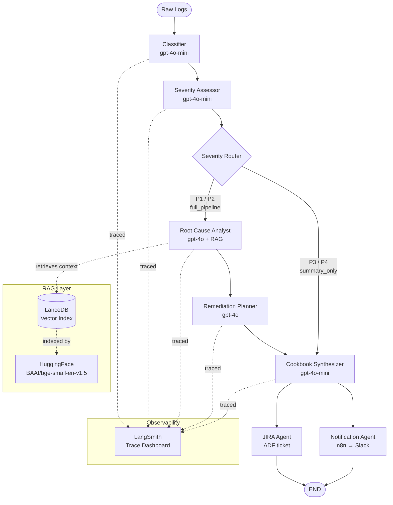

# CrewOps — Multi-Agent DevOps Incident Analysis Suite

> **Hackathon Project** | AI-powered incident triage, root cause analysis, and automated remediation using LangGraph multi-agent orchestration.

---

## 🎯 Problem Statement

Modern production systems generate thousands of log lines per minute. On-call engineers face:
- Alert fatigue from undifferentiated noise
- Context-switching between dashboards, runbooks, and JIRA
- Slow manual root-cause analysis under pressure

**CrewOps** transforms raw log streams into decisive action — classified, triaged, root-caused, remediated, ticketed, and notified — in under 60 seconds.

---

## 🏗️ Architecture

### Agent Pipeline Overview

```
Raw Logs (text or file)
        │
        ▼
┌───────────────────────────────────────────────────────────────────┐
│                     LangGraph StateGraph                          │
│                                                                   │
│   START ──► [Classifier] ──► [Severity Assessor]                  │
│                                      │                            │
│                        ┌─────────────┴──────────────┐             │
│                    P1/P2 (full_pipeline)         P3/P4 (summary)  │
│                        ▼                            ▼             │
│              [Root Cause Analyst]            [Cookbook Agent]     │
│              (RAG-grounded, gpt-4o)                │              │
│                        │                      [Notification]      │
│              [Remediation Planner]                 │              │
│              (gpt-4o)  │                          END             │
│                        ▼                                          │
│              [Cookbook Synthesizer]                               │
│              (gpt-4o-mini)                                        │
│                        │                                          │
│              ┌─────────┴─────────┐  ← parallel fan-out            │
│              ▼                   ▼                                │
│        [JIRA Agent]    [Notification Agent]                       │
│              │                   │                                │
│             END                 END                               │
└───────────────────────────────────────────────────────────────────┘
        │                   │                    │
        ▼                   ▼                    ▼
  LangSmith Traces    JIRA Ticket          Slack / n8n Alert
```

### Mermaid Workflow Diagram



### Conditional Routing Logic

| Severity | Branch | Agents Invoked |
|----------|--------|----------------|
| **P1 / P2** | `full_pipeline` | Classifier → Severity → Root Cause → Remediation → Cookbook → **JIRA + Notification** |
| **P3 / P4** | `summary_only` | Classifier → Severity → Cookbook → **Notification only** |

---

## 🤖 Agent Roster

| # | Agent | Node Name | Model | Role |
|---|-------|-----------|-------|------|
| 1 | **Classifier** | `classifier` | `gpt-4o-mini` (fast) | Categorise log type; produce structured incident summary |
| 2 | **Severity Assessor** | `severity` | `gpt-4o-mini` (fast) | Assign P1–P4 triage; extract critical issues; set `approval_required` |
| 3 | **Root Cause Analyst** | `root_cause` | `gpt-4o` (reasoning) | RAG-grounded deep RCA from LanceDB knowledge base |
| 4 | **Remediation Planner** | `remediation` | `gpt-4o` (reasoning) | Step-by-step remediation plan grounded in RCA output |
| 5 | **Cookbook Synthesizer** | `cookbook` | `gpt-4o-mini` (generation) | Operational runbook / SOP from full incident context |
| 6 | **JIRA Agent** | `jira` | — | Creates ADF-formatted JIRA ticket (mock or live) |
| 7 | **Notification Agent** | `notification` | — | Posts Slack Block Kit alert via n8n Incoming Webhook |

---

## 🎨 User Interface & Operational Console

CrewOps features a high-fidelity, futuristic React-based dashboard designed for high-stakes DevOps environments. For a full visual breakdown, refer to the [Official Technical Report](./CrewOps_Official_Report.html).

### 1. Main Dashboard (`/dashboard`)
*The Command Center for Incident Ingestion*
- **Multi-Format Ingestion:** Support for raw text, file uploads (log, txt, json), and real-time stream simulation.
- **Agentic Progression Feed:** A real-time visualization of the 7-agent pipeline. Watch as the **Classifier** identifies the failure, the **Severity Assessor** triages the risk, and the **Analyst** retrieves RAG context.
- **Structured Intelligence Cards:** Results are presented in an executive-ready format, detailing the Incident Summary, Root Cause Analysis, and a step-by-step Remediation Plan.

### 2. Analytics Hub (`/dashboard/analytics`)
*Data-Driven Insights for SRE Managers*
- **Performance Benchmarking:** Real-time MTTR (Mean Time To Resolution) charts comparing CrewOps autonomous response times against industry-standard manual benchmarks.
- **Operational Health:** Visual tracking of agent accuracy, cost-per-incident (token usage), and severity distribution across your infrastructure.
- **Trend Analysis:** Identify recurring failure patterns and hot-spots in your k8s or cloudwatch logs.

### 3. RAG Tuning Studio (`/dashboard/rag`)
*The Developer's Control Plane*
- **Vector Index Management:** Direct visibility into the **LanceDB** vector store. Manage knowledge chunks, update documentation, and re-index the knowledge base in real-time.
- **Embedding Sandbox:** Test the retrieval grounding by querying the vector index with natural language. Verify that the **Analyst** has access to the correct troubleshooting playbooks.
- **Model Orchestration:** Configure temperature settings and model selection (e.g., gpt-4o vs Claude) for individual agents in the pipeline.

---

## 📄 Official Documentation

For a comprehensive technical whitepaper, system architecture diagrams, and executive-level overview, please view the:
**[CrewOps Official Technical Report](./CrewOps_Official_Report.html)**

---

## 🗂️ State Schema (`CrewOpsState`)

All 7 nodes share a single `TypedDict` state. Accumulating fields use `operator.add` reducers enabling safe parallel fan-out.

```
CrewOpsState
├── Input
│   ├── raw_logs: str                          # Original log text
│   └── metadata: dict                         # Filename, timestamp, user
│
├── Classification
│   ├── log_summary: str                       # Structured classifier report
│   └── log_type: str                          # k8s | nginx | cloudwatch | application | mixed
│
├── Severity
│   ├── severity: str                          # P1 | P2 | P3 | P4
│   ├── severity_rationale: str
│   └── critical_issues: list[str]  ← add()   # Accumulates across parallel branches
│
├── Root Cause (P1/P2 only)
│   ├── rag_context: list[str]      ← add()   # Retrieved KB chunks
│   └── root_cause_analysis: str
│
├── Remediation (P1/P2 only)
│   └── remediation_plan: str
│
├── Cookbook
│   └── cookbook: str                          # Runbook / SOP
│
├── Human Approval
│   ├── approval_required: bool                # True for P1/P2
│   └── approval_status: str                   # pending | approved | auto_approved
│
├── JIRA
│   └── jira_tickets: list[dict]    ← add()
│
├── Notifications
│   └── notifications_sent: list    ← add()
│
└── Pipeline Metadata
    ├── pipeline_status: dict       ← merge() # Per-agent timing + status
    └── errors: list                ← add()   # Non-fatal error accumulator
```

---

## 🚀 Quick Start

### Prerequisites

- Python 3.11+
- OpenRouter API key (for LLM access)
- JIRA API token *(optional — mock mode by default)*
- Slack Incoming Webhook URL *(optional — mock mode by default)*
- n8n instance with `slack-alert` webhook *(optional)*

### 🚀 Launch Command Center

#### 1. Backend (FastAPI)
```bash
cd backend
python -m venv .venv
source .venv/bin/activate  # Windows: .venv\Scripts\activate
pip install -r requirements.txt
pip install -e .

# Run the FastAPI server from /backend
uvicorn api.main:app --reload --port 8000

# Swagger UI: http://localhost:8000/docs
```

#### 2. Frontend (React + Vite)
```bash
# In a new terminal (root directory)
npm install
npm run dev

# Vite app: http://localhost:5173
```

---

### Configure Environment

```bash
cp .env.example .env
```

Edit `.env`:

```env
# Required
OPENROUTER_API_KEY=sk-or-...
LANGCHAIN_API_KEY=ls__...
LANGCHAIN_TRACING_V2=true
LANGCHAIN_PROJECT=CrewOps-Hackathon

# JIRA (set JIRA_MOCK_MODE=false to enable live tickets)
JIRA_MOCK_MODE=true
JIRA_SERVER=https://your-org.atlassian.net
JIRA_EMAIL=you@example.com
JIRA_API_TOKEN=...
JIRA_PROJECT_KEY=OPS

# Notifications (set NOTIFICATION_MOCK_MODE=false to enable live alerts)
NOTIFICATION_MOCK_MODE=true
N8N_WEBHOOK_URL=https://your-n8n/webhook/slack-alert
SLACK_WEBHOOK_URL=https://hooks.slack.com/services/...
```

### 3. Run Options

**Streamlit Dashboard (recommended)**
```bash
streamlit run app.py
# → http://localhost:8501
```

**CLI / headless**
```bash
python run.py
```

**Interactive Notebook**
```bash
jupyter notebook Devops_Logs_Agent_Analyser.ipynb
# Run all cells top-to-bottom (local dev — no Colab required)
```

---

## 🛠️ Technology Stack

| Layer | Technology | Notes |
|-------|-----------|-------|
| Agent Orchestration | LangGraph ≥0.3.0 | `StateGraph` with TypedDict + reducers |
| LLM Provider | OpenRouter | `gpt-4o-mini` (fast/gen), `gpt-4o` (reasoning) |
| Observability | LangSmith | Auto-traces all 7 nodes |
| Vector Store | LanceDB ≥0.8 | Local on-disk `lancedb/` directory |
| Embeddings | `BAAI/bge-small-en-v1.5` | Local HuggingFace — **no OpenAI key needed for RAG** |
| RAG Framework | LlamaIndex ≥0.11 | Indexes `data/knowledge_base/` Markdown docs |
| JIRA Integration | `jira` ≥3.8 | ADF-formatted ticket descriptions |
| Notifications | n8n Incoming Webhook → Slack | Block Kit rich messages |
| Dashboard UI | Streamlit ≥1.45 | Multi-page via `st.navigation()` |
| Tests | pytest ≥8.0 | 166 tests across 6 test files, zero LLM calls |

---

## Project Structure

```
CrewOps-React/
|-- package.json                         # React/Vite scripts and frontend dependencies
|-- vite.config.js                       # Vite configuration
|-- index.html                           # React app entry HTML
|-- README.md
|
|-- src/                                 # React frontend at repo root
|   |-- main.jsx                         # React bootstrap
|   |-- App.jsx                          # App shell and routing
|   |-- index.css                        # Global styles
|   |-- store.js                         # Zustand app state and API streaming logic
|   |
|   |-- config/
|   |   `-- api.js                       # Default API and websocket URLs
|   |
|   |-- pages/
|   |   |-- LandingPage.jsx              # Public landing page
|   |   |-- Home.jsx                     # Dashboard, log input, live stream, results
|   |   |-- Analytics.jsx                # Incident and pipeline analytics
|   |   |-- RagTuning.jsx                # RAG/LLM tuning studio
|   |   `-- Docs.jsx                     # Product/API documentation page
|   |
|   |-- components/
|   |   |-- Sidebar.jsx
|   |   |-- PipelineProgress.jsx
|   |   |-- AgentCard.jsx
|   |   |-- KpiCard.jsx
|   |   |-- IssuesTable.jsx
|   |   `-- CustomSelect.jsx
|   |
|   |-- data/
|   |   |-- mockData.js
|   |   `-- tuningConfig.js
|   |
|   `-- services/
|       `-- openrouter.js
|
`-- backend/                             # Python backend and original backend app files
    |-- requirements.txt                 # Backend dependency list
    |-- pyproject.toml                   # Backend package metadata
    |-- pytest.ini                       # Backend test config
    |-- run.py                           # CLI/headless pipeline runner
    |-- stream_logs.py                   # Live log stream helper
    |-- app.py                           # Streamlit entrypoint, if used
    |-- slack-template-n8n.json          # Importable n8n workflow template
    |-- Devops_Logs_Agent_Analyser.ipynb # Interactive notebook
    |
    |-- api/                             # FastAPI application
    |   |-- __init__.py
    |   |-- main.py                      # FastAPI app, /analyze, /health, websocket, webhook routes
    |   `-- tuning.py                    # /tuning models, presets, validation, pipeline run APIs
    |
    |-- pages/                           # Legacy Streamlit pages
    |   |-- home.py
    |   |-- 1_Analytics.py
    |   `-- 2_RAG_Tuning.py
    |
    |-- src/crewops/                     # Core CrewOps agent package
    |   |-- state.py                     # CrewOpsState TypedDict + reducers
    |   |-- agents.py                    # 7 node functions
    |   |-- graph.py                     # LangGraph build_graph() + severity router
    |   |-- prompts.py                   # Prompt templates
    |   |-- parsers.py                   # Severity, ADF, Slack block parsers
    |   `-- rag.py                       # LanceDB + LlamaIndex + HuggingFace embeddings
    |
    |-- data/
    |   |-- knowledge_base/              # RAG source Markdown docs
    |   `-- sample_logs/                 # Demo log scenarios
    |
    `-- tests/                           # Backend unit/integration tests
        |-- test_state.py
        |-- test_parsers.py
        |-- test_agents.py
        |-- test_graph.py
        |-- test_rag.py
        `-- test_integrations.py
```

---

## 🔧 Key Design Decisions

### TypedDict State (not Pydantic BaseModel)
LangGraph's `Annotated[list, operator.add]` reducers require `TypedDict`. Using `Pydantic BaseModel` breaks parallel fan-out — a critical bug found during development.

### 3-Tier LLM Factory
| Tier | Model | Temperature | Used By |
|------|-------|-------------|---------|
| `llm_fast` | `gpt-4o-mini` | 0.1 | Classifier, Severity |
| `llm_reasoning` | `gpt-4o` | 0.2 | Root Cause, Remediation |
| `llm_generation` | `gpt-4o-mini` | 0.3 | Cookbook |

### Dependency-Injected Nodes
`build_graph()` accepts optional `*_fn` parameters. In production, JIRA and Notification nodes are pre-bound with `.env` values via `functools.partial`. In tests, deterministic fake functions replace all 7 nodes — **zero LLM calls in the test suite**.

### Mock Mode Defaults
`JIRA_MOCK_MODE=true` and `NOTIFICATION_MOCK_MODE=true` by default — the pipeline runs fully without credentials. Set both to `false` in `.env` for live integrations.

### Local Embeddings (No OpenAI Key for RAG)
RAG uses `BAAI/bge-small-en-v1.5` via `llama-index-embeddings-huggingface`. First index build (~40s) downloads the model; subsequent runs use the local `lancedb/` cache.

### n8n Notification via Incoming Webhook
Slack integration uses an **Incoming Webhook** URL posted via n8n's HTTP Request node — avoiding `not_allowed_token_type` errors common with Slack OAuth bot token workflows.

---

## 📊 Demo Scenarios

| Scenario | File | Log Types | Expected Severity | Key Outputs |
|----------|------|-----------|-------------------|-------------|
| **Payment Cascade Failure** | `mixed_incident.log` | application + redis + k8s | **P1 CRITICAL** | Full RCA, JIRA P1, Slack alert, remediation plan |
| **K8s CrashLoop OOMKilled** | `k8s_crashloop.log` | kubernetes | **P2 HIGH** | Memory analysis, resource-limits cookbook, JIRA P2 |

---

## 🧪 Test Suite

```bash
# Run all 166 tests
pytest

# Run a specific module
pytest tests/test_graph.py -v

# Run with coverage
pytest --cov=src/crewops --cov-report=term-missing
```

| Test File | Coverage Area | Key Tests |
|-----------|--------------|-----------|
| `test_state.py` | State schema, reducers | TypedDict fields, `operator.add` fan-out safety |
| `test_parsers.py` | Output parsers | Severity parsing, ADF builder, Slack block builder |
| `test_agents.py` | Agent nodes | All 7 nodes with mocked LLMs |
| `test_graph.py` | Graph topology + routing | 7 nodes registered, conditional router, E2E P1/P4 |
| `test_rag.py` | RAG pipeline | Index build, keyword fallback, search results |
| `test_integrations.py` | JIRA + Notifications | Mock mode, live mode, error handling |

---

## 🔌 n8n Slack Integration Setup

Import `slack-template-n8n.json` into your n8n instance:

1. **Create a Slack Incoming Webhook**: [api.slack.com/apps](https://api.slack.com/apps) → your app → Incoming Webhooks → Add to workspace → copy URL
2. **Set in `.env`**: `SLACK_WEBHOOK_URL=https://hooks.slack.com/services/T.../B.../...`
3. **Set n8n webhook**: `N8N_WEBHOOK_URL=https://your-n8n/webhook/slack-alert`
4. **Import workflow**: n8n → Workflows → Import → select `slack-template-n8n.json`
5. **Activate** the workflow

The template uses an HTTP Request node to POST directly to the Slack Incoming Webhook — no OAuth credentials required.

---

## 🔮 Future Enhancements

- [ ] Human-in-the-loop approval node for auto-remediation execution
- [ ] FastAPI REST wrapper for external log ingestion
- [ ] Multi-cluster Kubernetes operator integration
- [ ] PagerDuty + OpsGenie notification channels
- [ ] Historical incident correlation via time-series embeddings
- [ ] Auto-PR generation for infrastructure configuration fixes
- [ ] Streaming UI — real-time agent progress via `graph.stream()`

---

## 📜 License

---
The Crew: Rakshit Rangarajan, Monalisa Das, Shaik Himan Johny, Charchit Bansal, Prakash Patil
<br>*Built for the AI Post-Training Hackathon | CrewOps Team*
